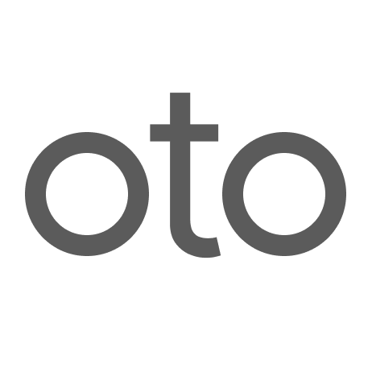
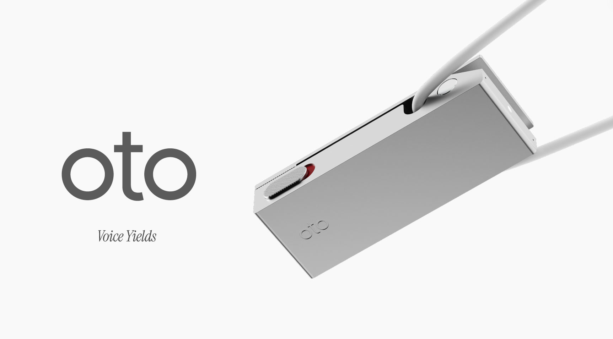

# Oto

## Vision
Turning the world's conversations into data

## Overview
There is almost no data of real-life conversations on the internet. This means speech-AI training data is drastically scarcer than text—something we have verified empirically. oto is a project that pairs a wearable voice-capture device with a smartphone app to turn daily conversations around the world into structured data. For speakers of major languages, oto unlocks personalized services—automatic task management, meeting notes, health insights. For under-represented languages and heavy accents, users can monetize their uploads by licensing data to AI firms. These incentives let us map global conversation flow, creating a speech-based Google Trends or Maps.

## The problem oto solves
There is a global shortage of voice data for AI training.
- Out of approximately 7,000 languages worldwide, voice AI supports only around 150—meaning 98% of languages remain unsupported.
- Even in major languages like English, speech models still perform poorly with accents and dialects.
- Voice AI systems are still unable to engage in human-level natural conversation.
All of these limitations stem from a fundamental lack of high-quality, diverse training data.
One notable initiative is Mozilla Common Voice, which treats voice as a public good. However, it still falls short in terms of dataset volume and diversity.
We aim to address this problem by building on the public-good model and introducing DePIN-style token incentives to accelerate the creation and sharing of diverse, real-world voice data at scale.

## Pitch Silde
https://www.figma.com/slides/zENm8UTvypmVpUscp14Imc/oto---Pitch-Deck?node-id=5-45&t=3RG8vMWEwdsLl8zv-0

## Product Page (Colosseum)

[https://arena.colosseum.org/projects/explore/oto](https://arena.colosseum.org/projects/explore/oto)

## LP

[https://oto-lp.vercel.app/](https://oto-lp.vercel.app/)

## Live demo(Solana)

[https://oto-gules.vercel.app/](https://oto-gules.vercel.app/)

## Live demo(EVM)

[https://oto-evm.netlify.app/](https://oto-evm.netlify.app/)

## Deployed Contract

[Solscan - otoUzj3eLyJXSkB4DmfGR63eHBMQ9tqPHJaGX8ySSsY](https://solscan.io/account/otoUzj3eLyJXSkB4DmfGR63eHBMQ9tqPHJaGX8ySSsY?cluster=devnets)

[Base Sepolia - 0x0a730733Ee85466278Cd31F452165A30971Ecdbd](https://sepolia.basescan.org/address/0x0a730733Ee85466278Cd31F452165A30971Ecdbd)

[Base - 0x2B5914De5D5166eBaa423C92BAb8518c85EAA0cb](https://basescan.org/address/0x2B5914De5D5166eBaa423C92BAb8518c85EAA0cb)

## GitBook

[https://oto-dev.gitbook.io/oto](https://oto-dev.gitbook.io/oto)
